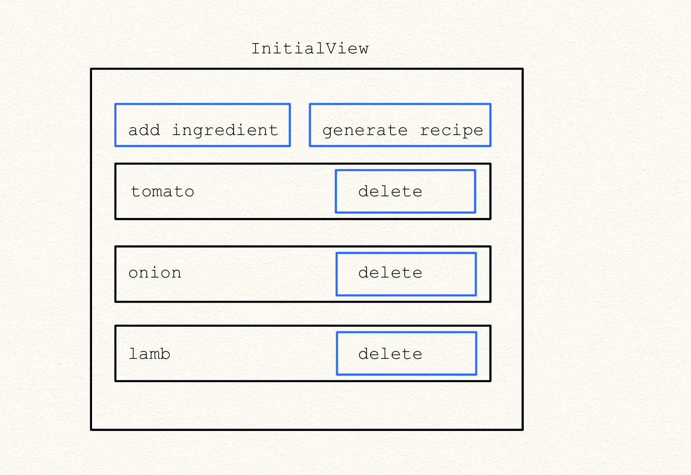
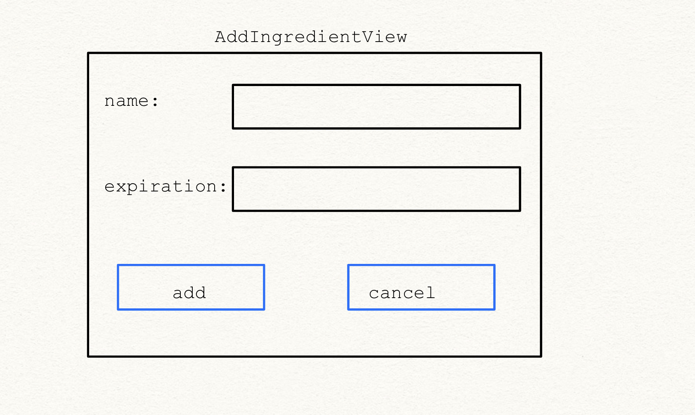
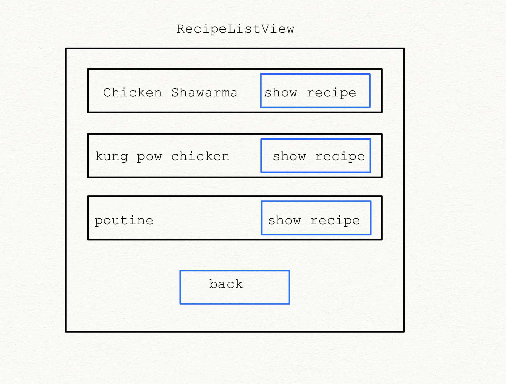
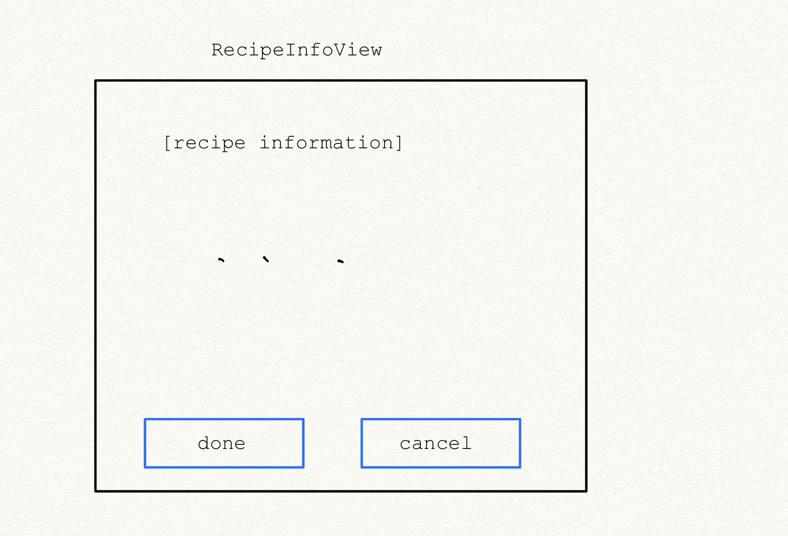
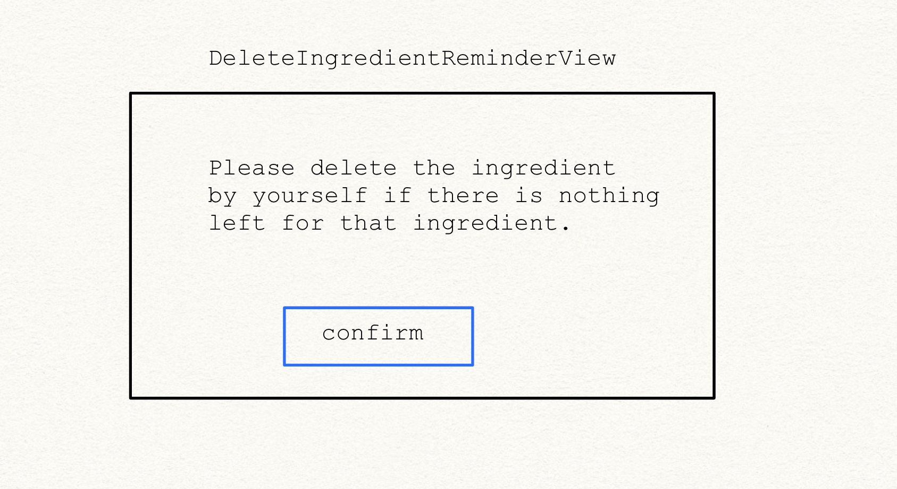
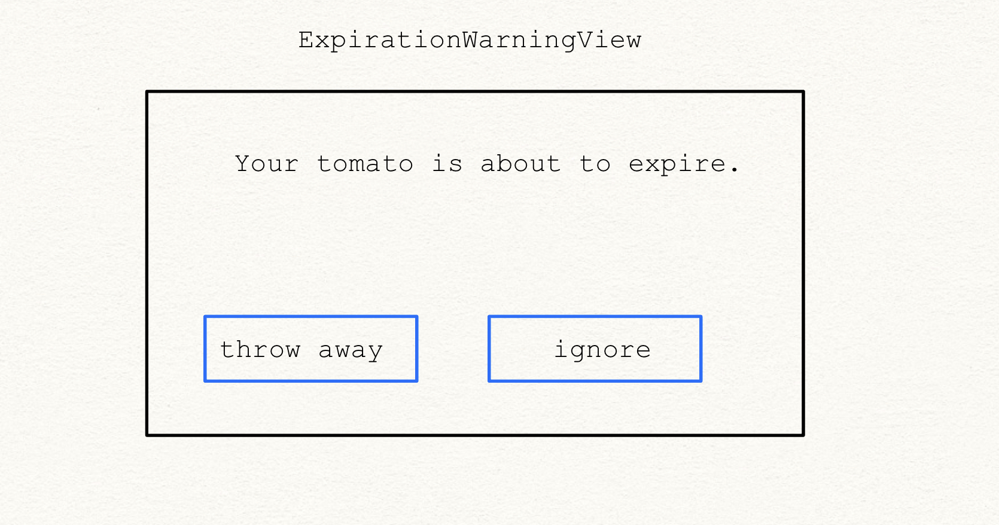

# Final Project: Recipe Generator

## Team members and Github usernames:

    Jiayun Kang == LucyK222
    Siru Zhao == AiYuri777
    Zhaokai Tian == Maxwell-Tian
    Junyang Qiao == Icarus02423
    Xiangting Tao == TTAT413/oldeight888

## User stories:

- As a user, I want to `add` my recently bought `ingredients` into my `fridge`, so that the algorithm could generate recipe accordingly.
- As a user, I may consume my ingredients in my fridge, so I want to `delete` ingredient in my fridge.
- As a user, I want to `generate recipe` according to my ingredient in my fridge.
- Everytime the user open up the app, the app will warn the user about the ingredient that almost expire
- As a terrible cook I wish I can have a software that can search up recipes using the `ingredient` I have in fridge, and search up the nutrition of the ingredients we have

## Use cases:

### use case for adding ingredient:

- click on the button `add ingredient` -> window `AddIngredientView` pop up
- click on the button `add` -> return to window `InitialView` and add the ingredient
- click on the button `cancel` -> return to window `InitialView`

### use case for deleting ingredient:

- click on the button `delete` -> ingredient deleted
  ( !! note: we should probably add a confirmation view !! )

### use case for generating recipe:

- click on the button `generate recipe` -> window `RecipeListView` pop up
- click on the button `show recipe` -> window `RecipeInfoView` pop up
- click on the button `back` (in `RecipeListView`)-> return to window `InitialView`
- click on the button `done` -> window `DeleteIngredientReminderView` pop up
- click on the button `confirm` -> return to window `InitialView` ( !! note: this could be done by JDialog !! )
- click on the button `cancel` (in `RecipeInfoView`)-> return to window `RecipeListView`

### use case for expiration warning:

- window `ExpirationWarningView` pop up
- click on button `throw away` -> return to window `InitialView` and ingredient deleted
- click on button `ignore` -> return to window `InitialView` and not deleting the ingredient and will not warn again about this ingredient.

### use case for searching recipes and nutrition base on the ingredients we have:

- click on button `Search for Nutrition`, it will show the nutrition info of ingredient per 100g
- window `NutritionView` pop up
- click on button `back` -> return to window `initialView`
